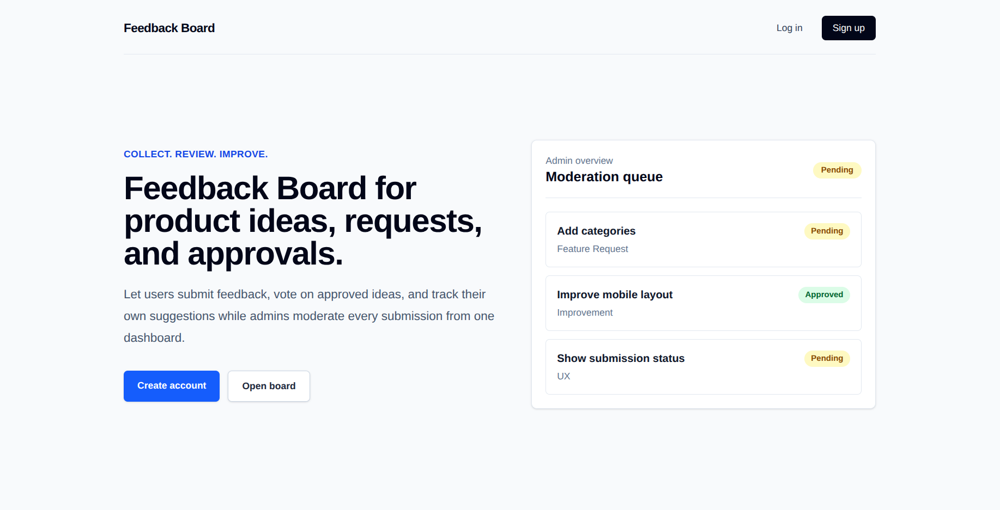
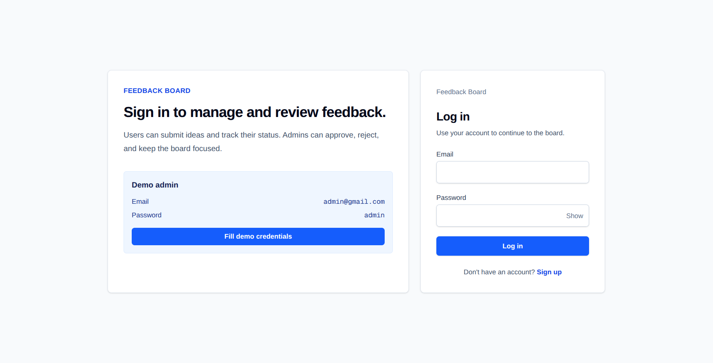
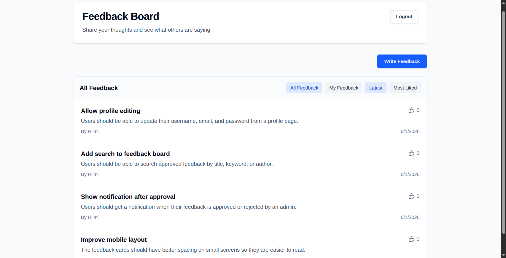
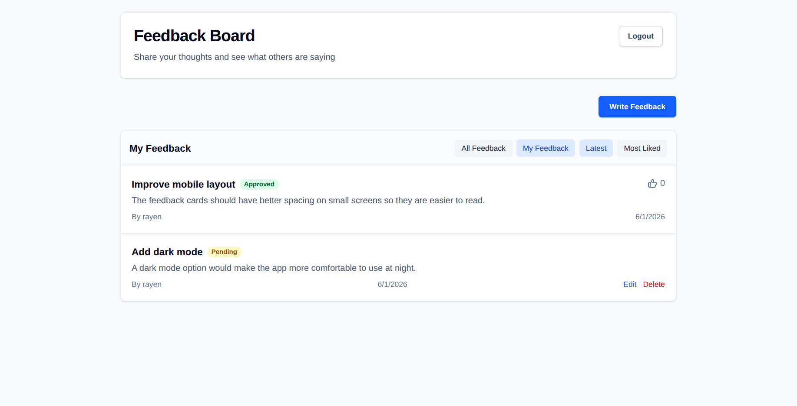
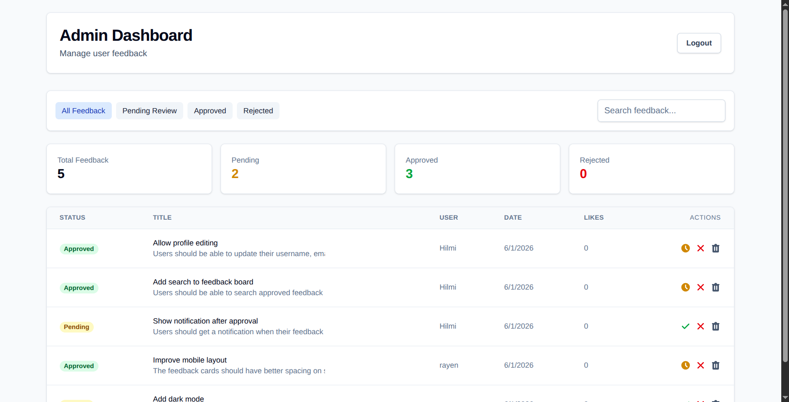

Feedback Management Website is a full web app built around collecting, displaying, and managing user feedback in a clean and organized way.

The project includes a public landing page, an authentication screen, a user-facing feedback board, a personal feedback tracking tab, and an admin dashboard for moderation. Together, these pages make the app feel like a complete product instead of only a simple form or static interface.

## Technologies Used

- React
- JavaScript
- Tailwind CSS

## Landing Page

The landing page gives the first impression of the application.

It introduces the purpose of the platform clearly: helping users share feedback while giving administrators a structured way to review, filter, and manage submissions. This page works as the entry point for the whole experience, so it focuses on clarity, trust, and quick navigation toward the main feedback flow.

## Login Experience

The login page provides access to the protected parts of the app.

It includes a clean sign-in form and an admin demo box, making it easier to test the dashboard without needing to guess credentials. This is useful for showcasing the project because visitors can quickly understand that the app supports both regular user interaction and admin-level management.

## Public Feedback Board

The feedback board shows approved feedback items in one shared space.

Users can browse existing feedback, read what others submitted, and understand how the community is interacting with the product. Showing several approved items makes the board feel active and gives the app a realistic product-feedback workflow.

## My Feedback Tracking

The My Feedback tab lets users track the status of their own submissions.

This part of the app is important because it closes the loop between submitting feedback and knowing what happened next. Status badges such as Pending, Approved, and Rejected make the moderation process clear, so users can immediately understand whether their feedback is still under review, visible to others, or declined.

## Admin Dashboard

The admin dashboard is the control center for managing feedback.

It includes statistics cards, filters, a search bar, and a feedback table, giving administrators a practical way to monitor submissions and make decisions. The layout is designed for scanning: admins can quickly check overall numbers, narrow the feedback list, search for specific entries, and review each item from the table.

## Why This Project Matters

Feedback is only useful when it can be collected, organized, and reviewed properly.

This project shows a complete feedback workflow from both sides: users can submit and follow their feedback, while admins can filter, search, and moderate entries from a dedicated dashboard. It is a strong example of a practical web application because it combines authentication, user experience, status tracking, and admin management in one connected product.
