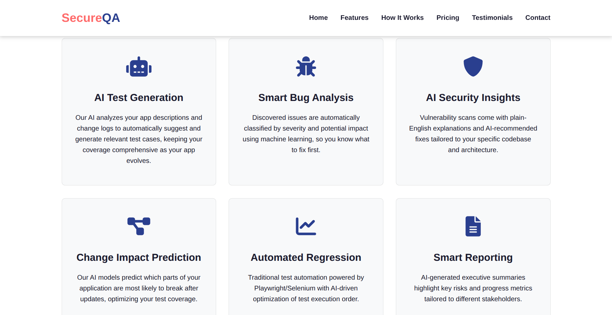
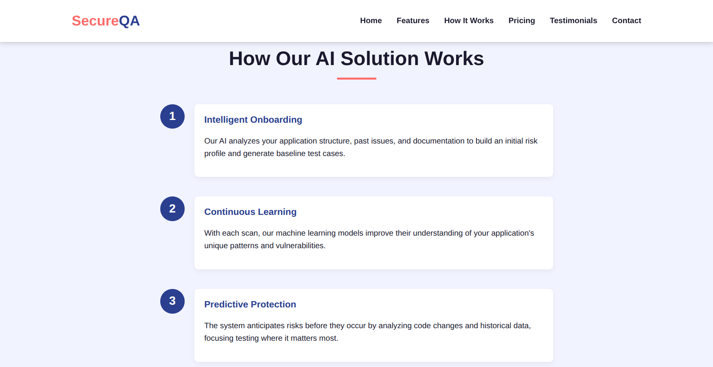
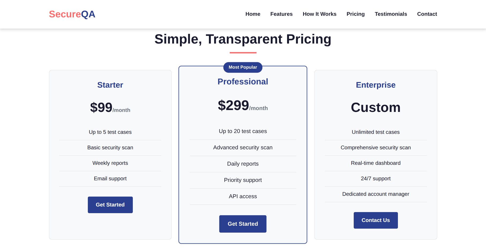
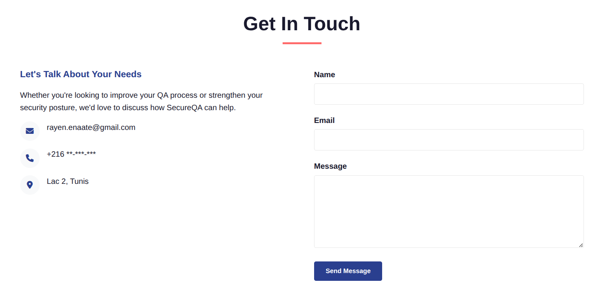

SecureQA is a professional vitrine website designed for an AI-powered quality assurance and cybersecurity startup.

The website presents the product through a modern SaaS landing page structure, starting with a strong hero section that explains the main idea: using artificial intelligence to improve software testing, predict risks, detect bugs, and strengthen application security.

> [!NOTE] Live Demo
> You can visit the project here: <a href="https://rayennaat.github.io/Vetrine/" target="_blank" rel="noopener noreferrer">SecureQA</a>

## AI Testing and Security Features

The features section highlights the main services offered by the platform.

It presents AI test generation, smart bug analysis, security insights, change impact prediction, automated regression testing, and smart reporting as part of one connected workflow.

## How The Solution Works

The "How It Works" section explains the process step by step.

It helps visitors understand how the system analyzes an application, learns from scans, and predicts potential risks before they become serious problems.

## Pricing and Trust

The pricing section gives the website a realistic business structure by offering different plans for different types of users, from small teams to enterprise clients.

Together with testimonials and trust-focused content, this makes the project feel like a complete startup landing page rather than just a static design.

## Professional Startup Design

This project focuses on clean design, professional branding, and clear communication.

The combination of blue and coral colors gives the website a modern tech identity, while the cards, buttons, icons, and structured layout make the user experience simple and easy to follow.

SecureQA can be used as a showcase website for a startup, SaaS product, QA automation service, cybersecurity company, or AI-based software tool. Overall, it is a strong example of a complete startup landing page because it combines marketing, service explanation, pricing, trust-building, and user contact in one web project.
