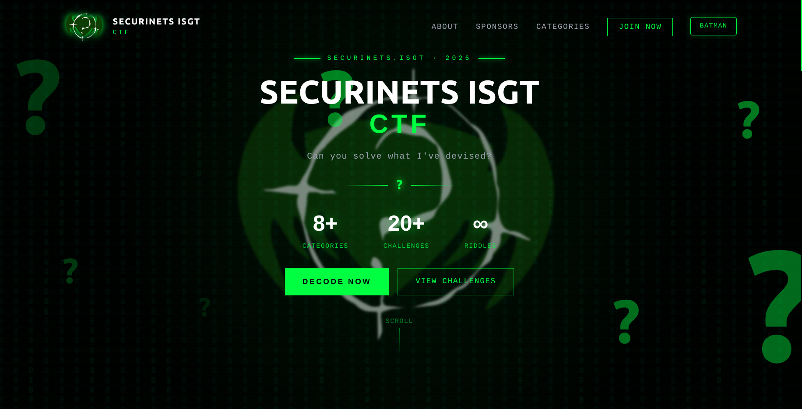
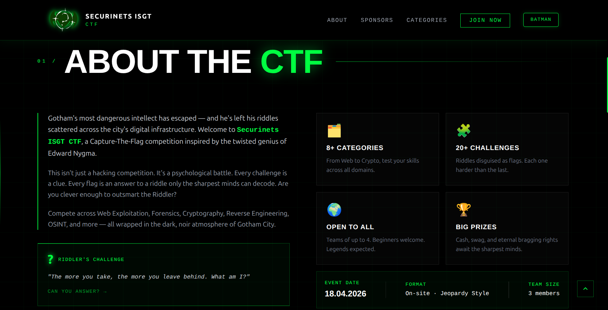
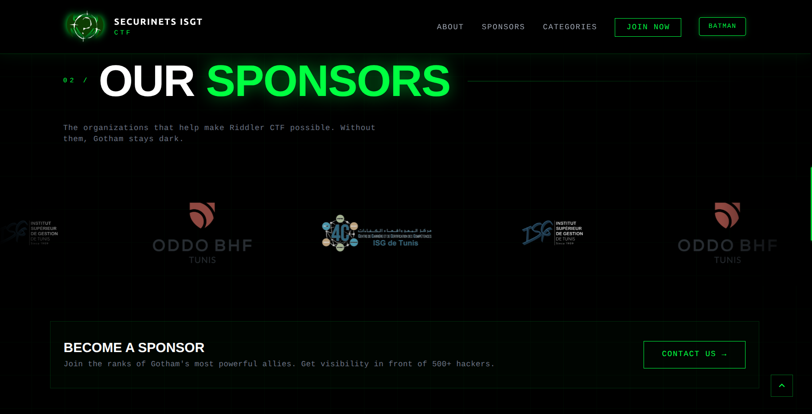
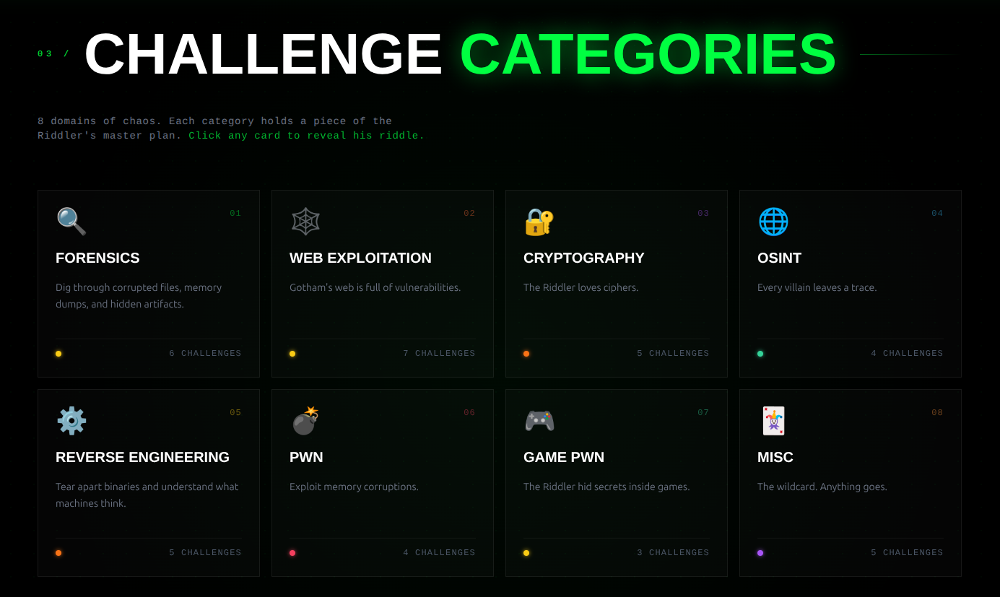

Securinets ISGT CTF is a dark, cyber-themed showcase website created to promote and present a Capture The Flag competition in a professional and exciting way.

The website acts like a vitrine for the event, giving visitors a clear overview of the CTF, its atmosphere, challenge categories, sponsors, and the main information participants need before joining.

> [!NOTE] Live Demo
> You can visit the website here: [Securinets ISGT CTF](https://rayennaat.github.io/)

## Cyber Event Identity

The design is inspired by hacking culture and the Riddler theme.

It uses a black background, neon green effects, glitch-style visuals, question marks, grid patterns, and terminal-like typography to create a mysterious and immersive cybersecurity experience.

## Event Overview

The website includes a strong hero section that introduces the event, highlights key numbers such as categories and challenges, and encourages users to join or view the challenges.

It also contains an "About the CTF" section that explains the concept of the competition, the story behind it, the event format, team size, and date.

## Sponsors and Challenge Categories

The sponsors section gives visibility to the organizations supporting the event.

The categories section presents different cybersecurity domains such as Forensics, Web Exploitation, Cryptography, OSINT, Reverse Engineering, PWN, Game PWN, and Misc.

## Why This Project Matters

This project focuses on both design and communication.

It does not only display information, but also creates a complete identity around the CTF, making the event feel competitive, mysterious, and memorable. The website is useful for attracting participants, presenting the event to sponsors, and giving the competition a professional online presence.

Overall, it is a strong example of a showcase website because it combines branding, event promotion, cybersecurity visuals, sponsor presentation, and clear event details in one modern landing page.
