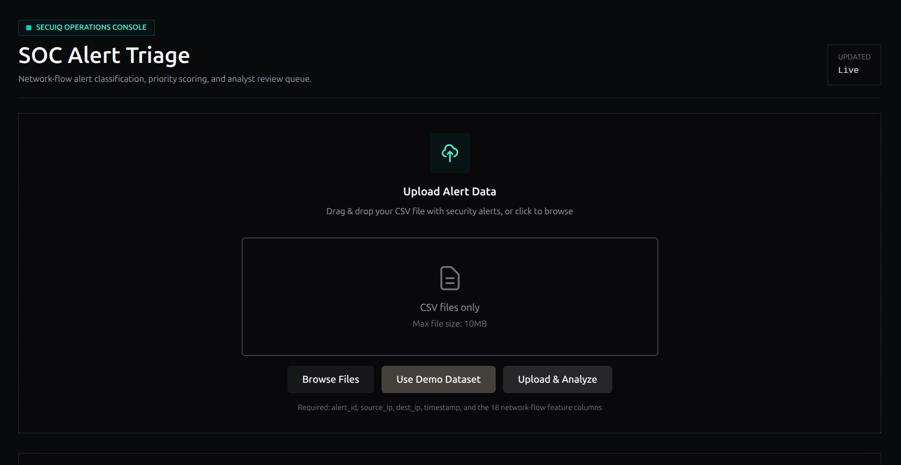
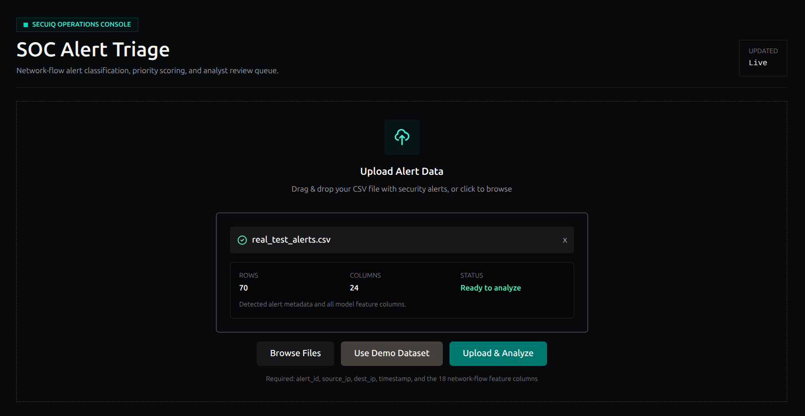
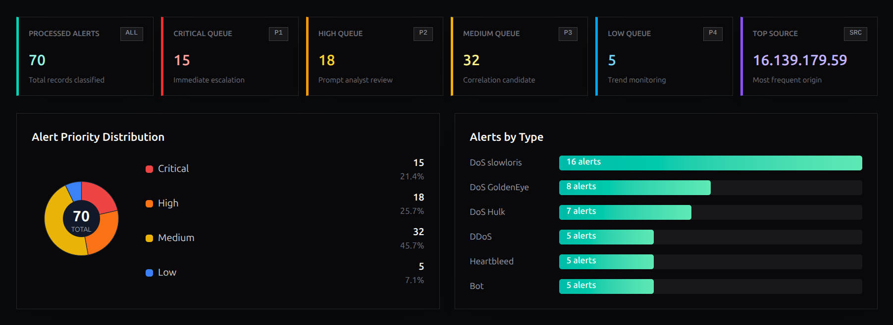
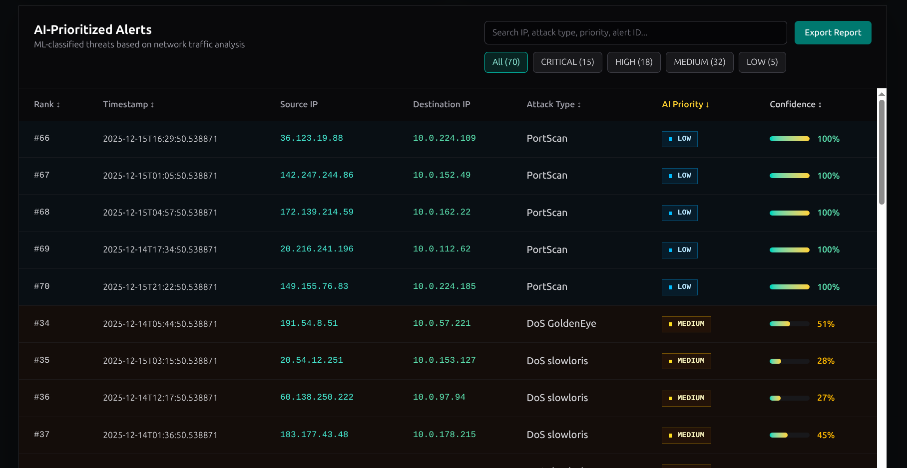
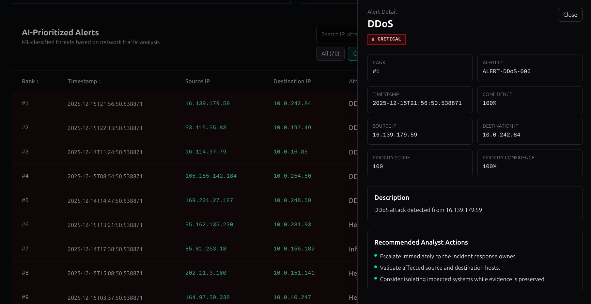
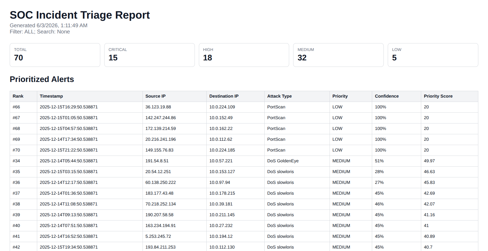

SOC ML Alert Prioritization Dashboard is a security operations project built to help analysts handle large volumes of alerts more efficiently.

The system takes network traffic or alert data from CSV files, analyzes the extracted features with machine learning models, predicts the attack type, assigns a priority level, and displays the results in a SOC-style dashboard. The goal is to reduce alert fatigue by helping analysts focus first on the alerts that are most likely to require immediate attention.

> [!NOTE] Live Demo
> You can visit the project here: <a href="https://soc-alert-triag-ewik.vercel.app/" target="_blank" rel="noopener noreferrer">SOC ML Alert Prioritization Dashboard</a>

## Technologies Used

- React
- TypeScript
- Tailwind CSS
- Java
- Spring Boot
- Spring Data JPA
- PostgreSQL
- Flyway
- Swagger/OpenAPI
- Python
- FastAPI

## Alert Upload and Analysis

The first screen shows the dashboard before any dataset is uploaded.

From this state, the analyst can upload CSV alert or network-flow data and send it through the analysis pipeline. The project is designed around already extracted network security features, so the machine learning service can focus on classification and prioritization instead of raw packet parsing.

After uploading the demo dataset and clicking **Upload & Analyse**, the dashboard processes the records and returns classified alerts with predicted attack categories, confidence values, and priority levels.

## ML-Based SOC Triage

The machine learning service is built with FastAPI, Pandas, NumPy, scikit-learn, and Joblib.

It receives the uploaded data, applies the trained model, predicts the likely attack type, and assigns a priority level such as **CRITICAL**, **HIGH**, **MEDIUM**, or **LOW**. This makes the project different from a simple SIEM dashboard because it is focused on alert triage after useful features have already been extracted.

Instead of only showing logs or static rules, the system acts like a small AI-assisted SOC triage layer that helps decide which alerts should be reviewed first.

## Statistics and Priority Distribution

The statistics screen summarizes the analyzed dataset with charts and priority cards.

The bar chart shows how many alerts were detected by attack type, while the pie chart shows the alert priority distribution. This gives the analyst a fast overview of the current security situation before opening individual alerts.

The summary cards show the main triage queues:

- **Processed Alerts:** 70 total records classified
- **Critical Queue:** 15 alerts requiring immediate escalation
- **High Queue:** 18 alerts requiring prompt analyst review
- **Medium Queue:** 32 alerts that may need correlation
- **Low Queue:** 5 alerts useful for trend monitoring
- **Top Source:** 16.139.179.59 as the most frequent origin

This view is important because SOC analysts need more than a raw table. They need a quick way to understand volume, severity, and where the most active sources are coming from.

## Alert Table

The alert table presents the classified results in a format that is easy to scan.

Each alert can be reviewed by severity, attack type, source, destination, confidence, and priority information. This makes the dashboard useful as an investigation queue, where analysts can start from critical alerts and then move down to lower priority events.

## Alert Detail View

Clicking an alert opens a detailed investigation view.

In this example, the selected alert is ranked first and classified as a **DDoS** attack with **CRITICAL** priority. The detail panel includes the alert ID, timestamp, confidence, source IP, destination IP, priority score, priority confidence, description, and recommended analyst actions.

The detail view gives the analyst clear next steps:

- Escalate immediately to the incident response owner.
- Validate affected source and destination hosts.
- Consider isolating impacted systems while evidence is preserved.

This makes the dashboard more practical because it does not only classify alerts. It also helps the analyst understand what action should happen next.

## Backend and Reporting

The backend layer is built with Spring Boot, Spring Data JPA, PostgreSQL, Flyway, and Swagger/OpenAPI.

It handles SOC-style API and data management, stores analyzed alerts, exposes REST endpoints, and supports future integration with real SOC tools or SIEM platforms. The separation between the Java backend and the Python ML service keeps the architecture modular: one service handles application data and APIs, while the other focuses on prediction and model logic.

The project also includes an exported HTML report so investigation results can be shared or saved after analysis.

## Why This Project Matters

Alert fatigue is one of the biggest problems in security operations.

When analysts receive too many alerts, the most dangerous events can be delayed or missed. This project tries to solve that problem by combining machine learning classification, priority scoring, visual summaries, alert details, and report export into one workflow.

Overall, SOC ML Alert Prioritization Dashboard is a more advanced cybersecurity project because it connects machine learning, backend engineering, database design, API documentation, and frontend dashboard development into a realistic SOC triage system.
