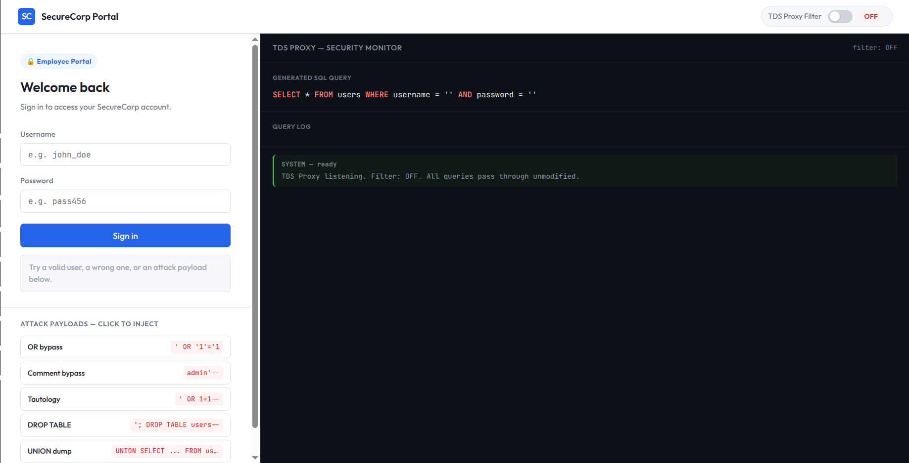
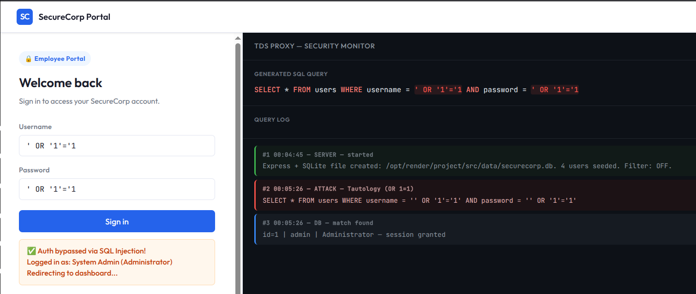
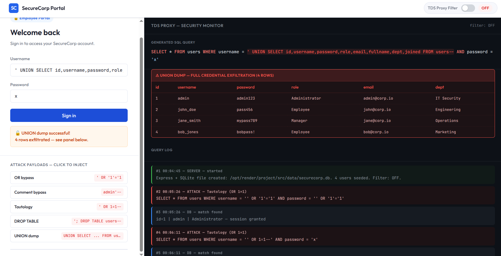
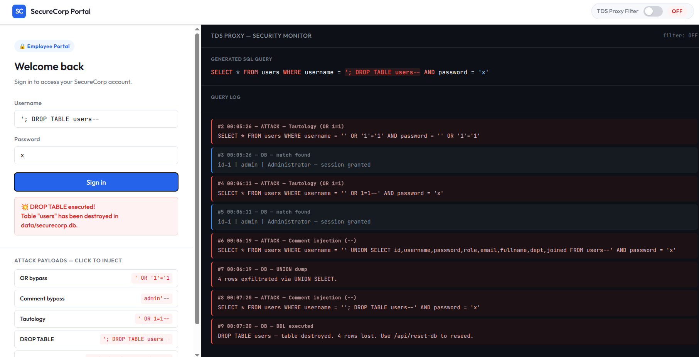
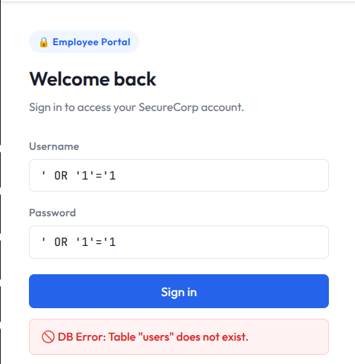

SQL Injection Demo is a hands-on educational platform that simulates real SQL injection attacks against a live web application.

The project was built to bridge the gap between theoretical vulnerability research and practical exploitation. It is directly inspired by Elshazly et al.'s survey on SQLIA detection and prevention, and it reproduces their proposed TDS Proxy filtering architecture as a working implementation.

> [!NOTE] Live Demo
> You can visit the project here: <a href="https://sql-injection-demo-50wa.onrender.com/" target="_blank" rel="noopener noreferrer">SQL Injection Demo</a>

## Technologies Used

- Python
- Flask
- SQLite
- JavaScript

## Vulnerable Flask Application

The application runs a Flask backend connected to a persistent SQLite database seeded with user accounts across multiple roles.

The login endpoint is intentionally vulnerable. User input is concatenated directly into raw SQL queries, making the app susceptible to common SQL injection categories such as OR-based authentication bypass, comment injection, tautology attacks, UNION-based data exfiltration, and stacked DDL queries.

## Real Queries, Real Results

Every query is executed against the real SQLite database, so the attacks produce genuine results rather than simulated responses.

This makes the project useful for learning how SQL injection payloads affect an actual backend and how small changes in input can completely change the meaning of a database query.

## Live Security Monitor

The right panel of the interface acts as a live security monitor.

It displays the generated SQL query in real time as the user types, highlights injected fragments, and streams a timestamped query log that separates normal traffic from attack attempts.

## TDS Proxy Defense Filter

The project also includes a TDS Proxy filter toggle that implements signature-based detection.

When enabled, regex patterns are matched against known injection signatures. Malicious queries are intercepted and dropped before they reach the database, and each blocked attempt is logged with the identified threat category.

> [!WARNING] Database Reset
> Some payloads can demonstrate destructive behavior, including `DROP TABLE`. After dropping the table, you can reset the database here: [Reset Database](https://sql-injection-demo-50wa.onrender.com/api/reset-db)

Overall, SQL Injection Demo is a practical security learning tool because it combines vulnerable application behavior, live exploitation, query monitoring, and a working defensive filter in one complete web project.
