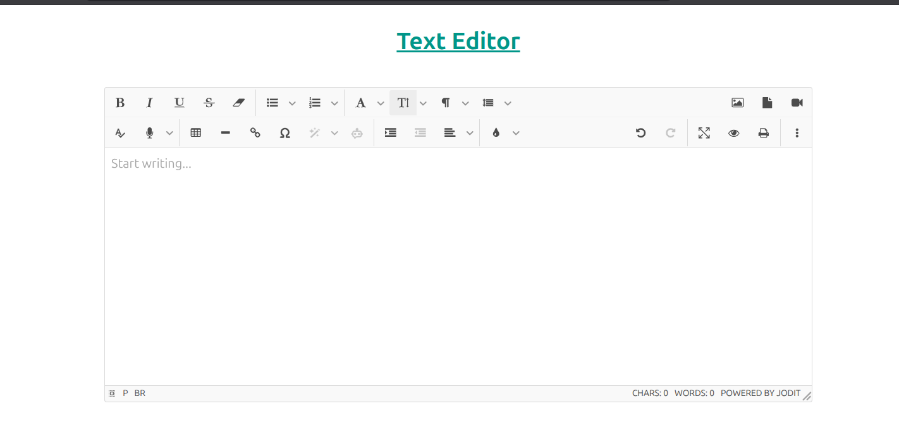
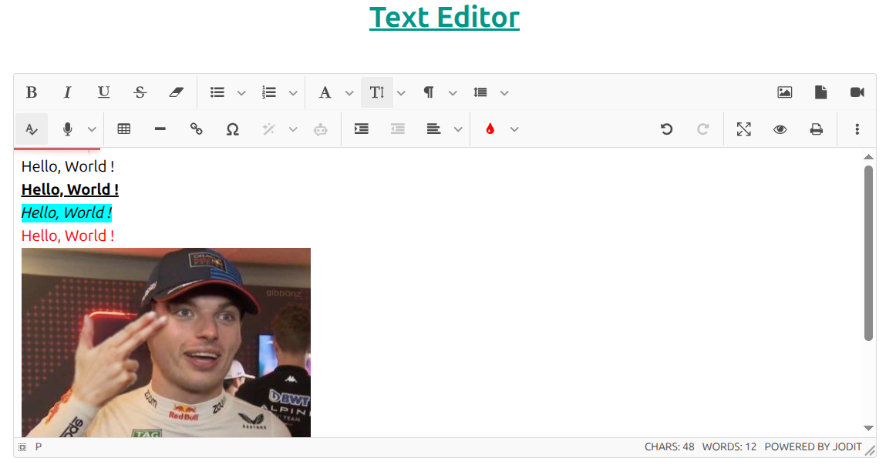

This project is a modern web-based text editor that allows users to create and format rich content easily.

It supports common writing tools like bold text, italic text, underline, colors, alignment, and lists, while also providing more advanced content features for real web applications.

> [!NOTE] Live Demo
> You can visit the project here: <a href="https://text-editor-by5j.onrender.com/" target="_blank" rel="noopener noreferrer">Modern Web-Based Text Editor</a>

## Technologies Used

- React
- JavaScript
- Tailwind CSS

## Rich Content Editing

The editor is designed to give users control over how they write and present their content.

Alongside basic text styling, it supports inserting images, attaching files, creating tables, adding links, writing code lines, and embedding media. This makes it more flexible than a simple input field and more useful for projects where structured content matters.

## Where It Can Be Used

The simple and user-friendly interface makes this editor suitable for many types of platforms.

It can be used in blogs, note-taking apps, admin dashboards, documentation platforms, educational websites, and any project that needs content creation. It can also be implemented inside a larger web application to give users a better way to write, organize, and manage their content.

## Why This Project Matters

Content creation is a common feature in modern web apps, but plain text inputs often feel limited.

This project solves that by providing a clean rich text editing experience that can be reused across different products, helping users create better content without needing technical knowledge.
