This post collects three OSINT challenges:

1. **3 Villains** - identifying three Batman villains from a hidden pop-culture reference.
2. **Operation Defuse** - geolocating a photo in the Tunis / Carthage area.
3. **CA** - using what3words and historical satellite imagery to identify a changed roof.

## 3 Villains

## Challenge Description

The challenge gives a clue pointing toward the **796th floor**.

That phrase is the key. Searching for it leads directly to [floor796.com](https://floor796.com/), a huge pixel-art depiction of life on the 796th floor of a space station. The map is packed with pop-culture references, so the solution depends on exploring it carefully.

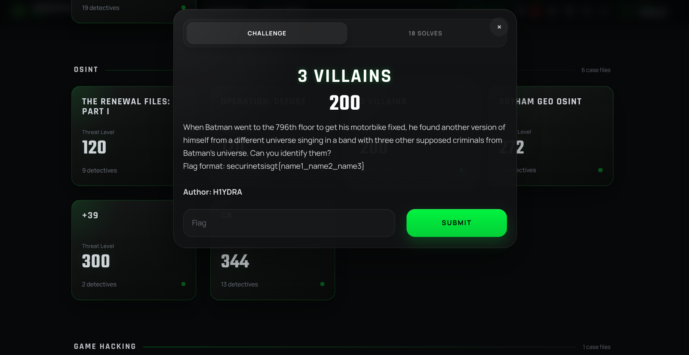

## Exploration

After opening the map, the next step is simple: scroll around and inspect the rooms.

Eventually, you find a Batcave-styled zone featuring a band called **BATMETAL** performing on stage.

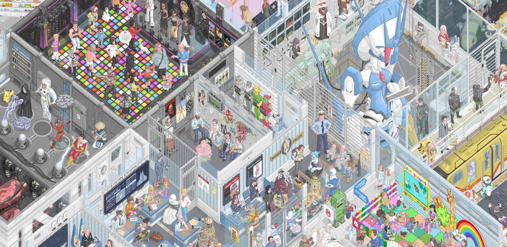

The scene shows an alternate-universe Batman fronting alongside three classic villains from his universe:

- Riddler
- Penguin
- Bane

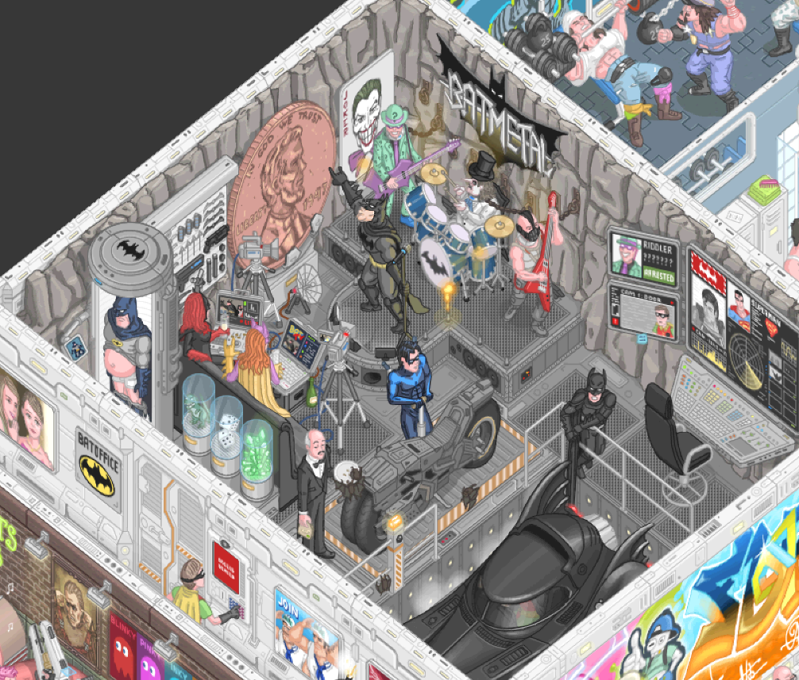

## Flag

```text
securinetsisgt{riddler_penguin_bane}
```

---

## Operation Defuse

## Challenge Description

The challenge gives a photo and asks for the location where it was taken.

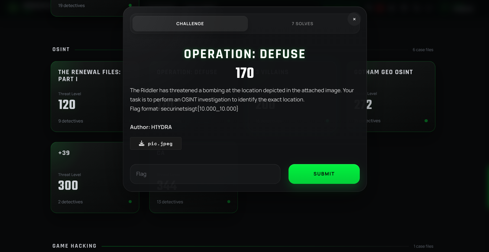

## Initial Observations

Looking at the image, three landmarks immediately stand out:

- A cathedral on a hilltop in the top-left.
- Mountains in the background, recognizable as Bou Kornine.
- A city layout that fits the Tunis / Carthage area.

Tunisia does not have many cathedrals that match this view. Combined with the mountain backdrop, this identifies the landmark as the **Cathedral of Carthage**.

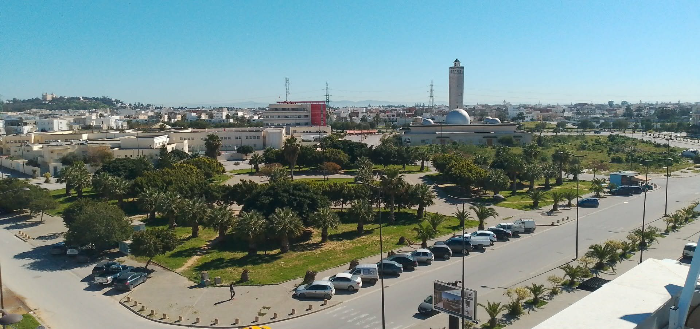

## Finding the Camera Position

The next step is figuring out where the photo was actually taken from.

The image appears to be shot from a high floor. Below it, there is a large green garden or park, palm-tree-lined roads, and a mosque with a tall minaret.

With those anchors, I searched the surrounding area on Google Maps and checked nearby mosques one by one. The match was **Essalem Mosque**, which has a garden right next to it that lines up with the image.

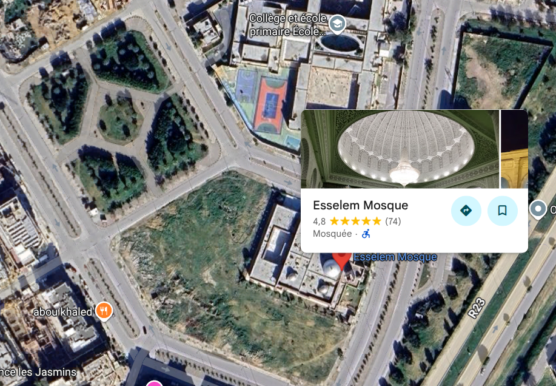

From there, checking the road across from the mosque and garden reveals the likely building: the **Concentrix call center**.

Street View confirms the angle. The mosque, garden, and surrounding roads line up with the original photo.

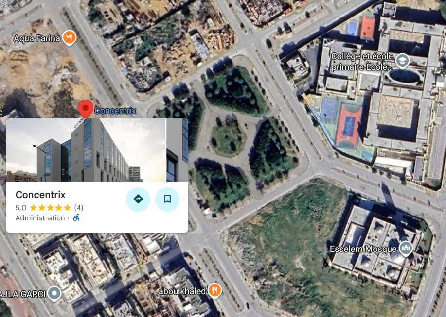

## Flag

```text
securinetsisgt{36.848_10.298}
```

---

## CA

## Challenge Description

The attached file shows a blurred image with a phone in the foreground.

On the phone, there is a note containing the word **Tunis** and the three-word clue:

```text
energetic.export.jotting
```

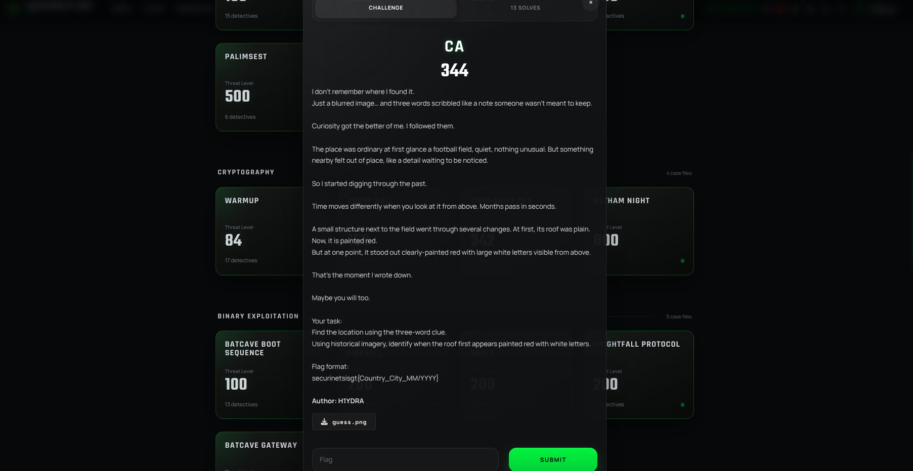

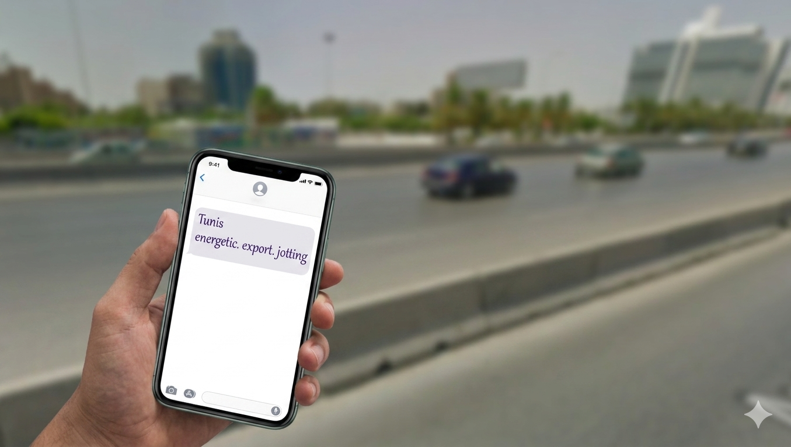

## Using The Clue

The clue format points to **what3words**.

Searching for `energetic.export.jotting` gives multiple possible locations, but the note also says **Tunis**, which makes the Tunis result the correct one.

Opening that location leads to a football field in Tunis. The field belongs to the **Club Africain training complex**.

Near the field, there is a small structure with a red roof, matching the description in the challenge.

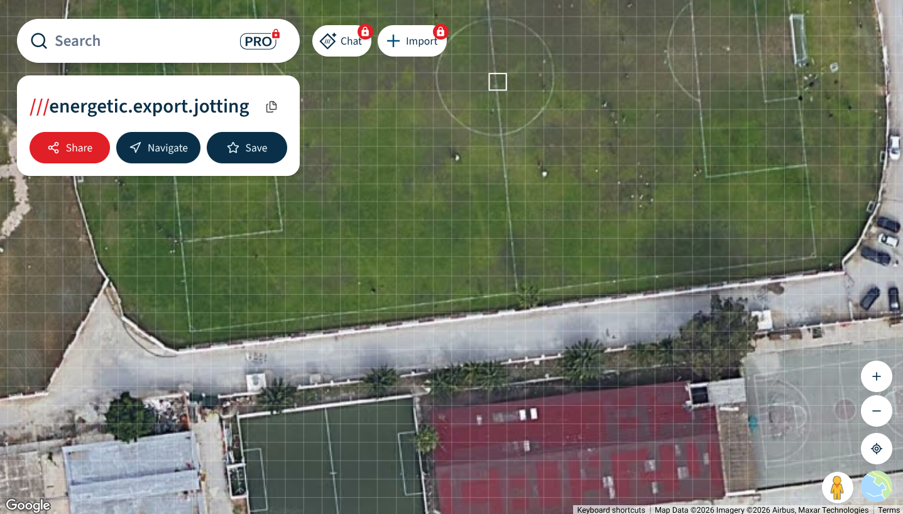

## Historical Imagery

The challenge mentions that the roof changed over time, so the next step is checking historical satellite imagery.

Using Google Earth Pro and going back through the timeline shows that the roof was not always the same. In one historical image, the roof appears red with large white letters painted on it.

The first clear match appears in **06/2010**. The location is in **Tunisia**, in the city of **Tunis**.

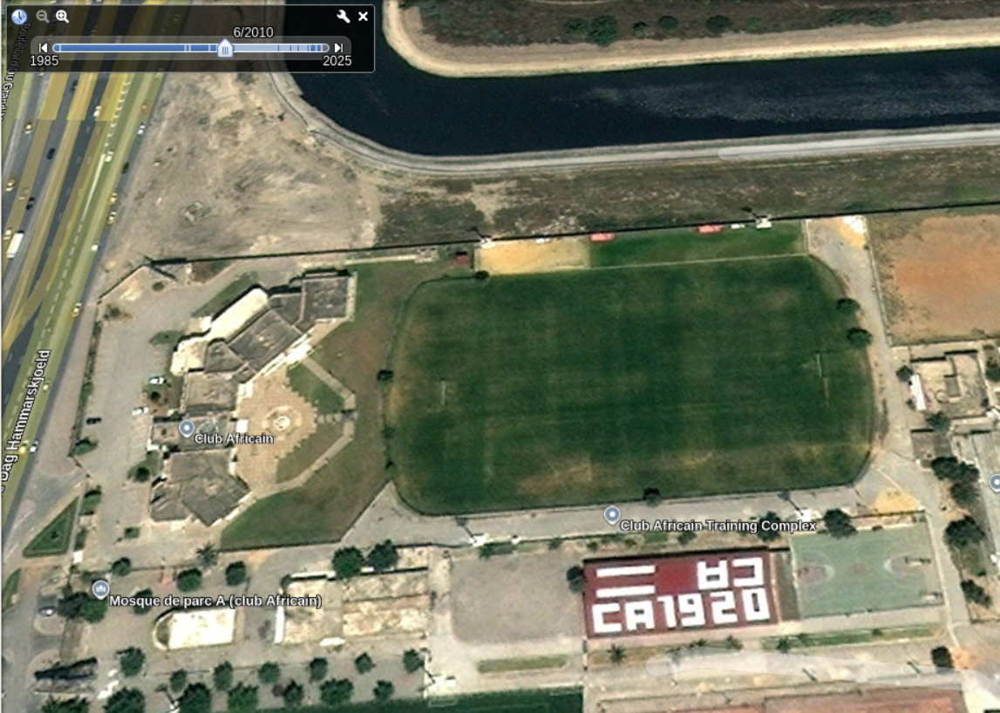

## Final Flag

```text
securinetsisgt{TUNISIA_TUNIS_06/2010}
```
